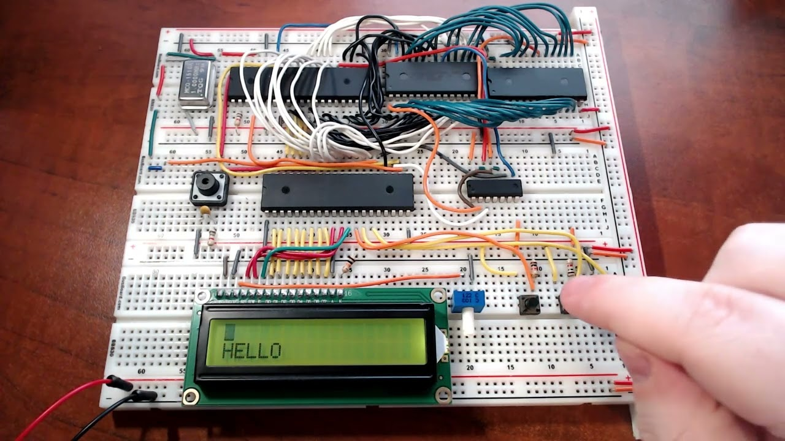
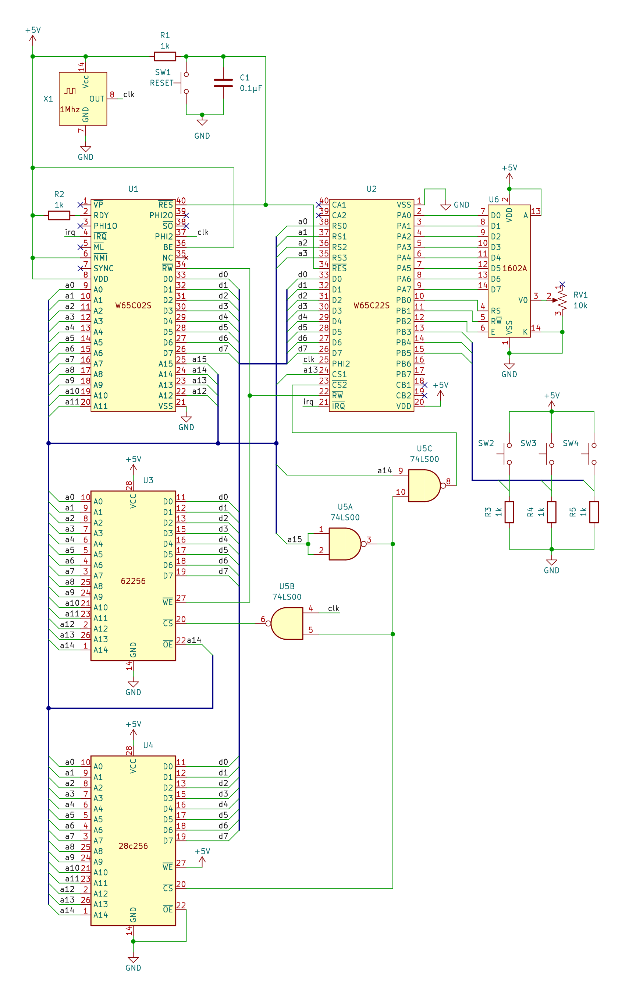

# Morse Code Translator
This project is a modified version of Ben Eater's 6502 computer that can be
translate Morse Code into text characters.

### Demo Video

## Brief Tour of the Project
### Hardware
This computer is derived from
[Ben Eater's 6502 computer](https://eater.net/6502) with some modifications.
Here's a full schematic of my version of the computer:

The user interface is made up of 3 buttons, "dit", "dah", and "enter/space",
along with an LCD display. These interface with the w65c02 via the w65c22 
versatile interface adapter. The VIA is also used by the computer to measure 
time in order to de-bounce the buttons through software.

### Software
The software for this project is written in C and cc65 macro assembly. These
sources are compiled/assembled using [cc65](https://cc65.github.io/), a suite of
tools for 6502/65c02 development. Cc65 includes support for many machines that
use these chips, but since this hardware is custom the cc65 tools are provided
with a custom configuration (i.e. `custom.cfg` and `custom.lib`).

In addition to the logic for translating American morse code, the software
includes custom drivers and an API for providing high level access to the
buttons and LCD.